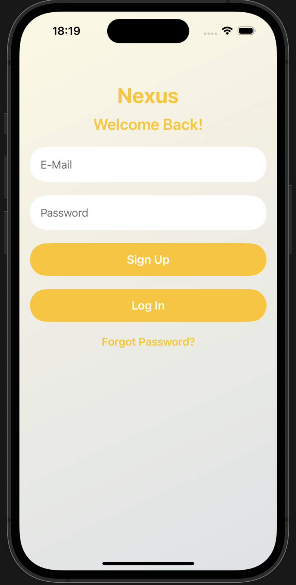
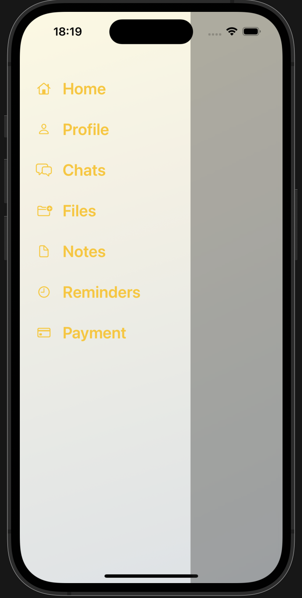
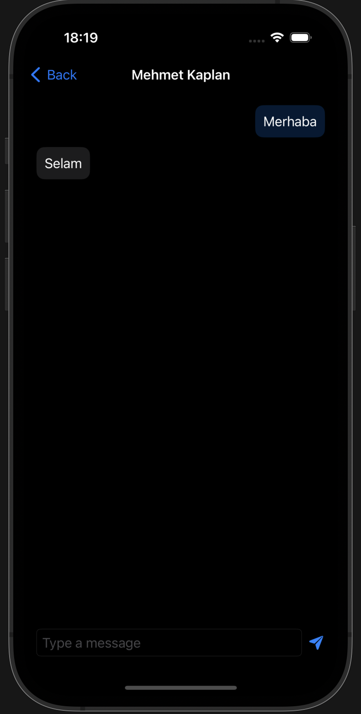
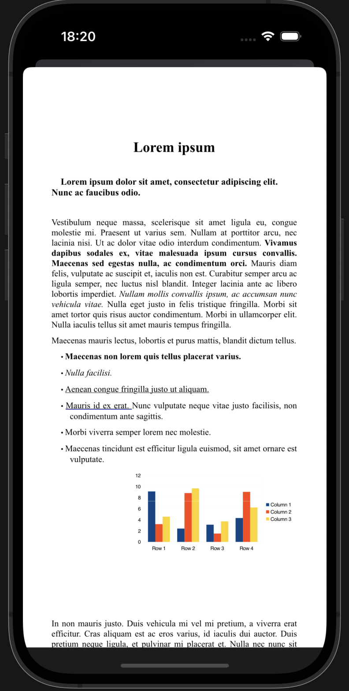
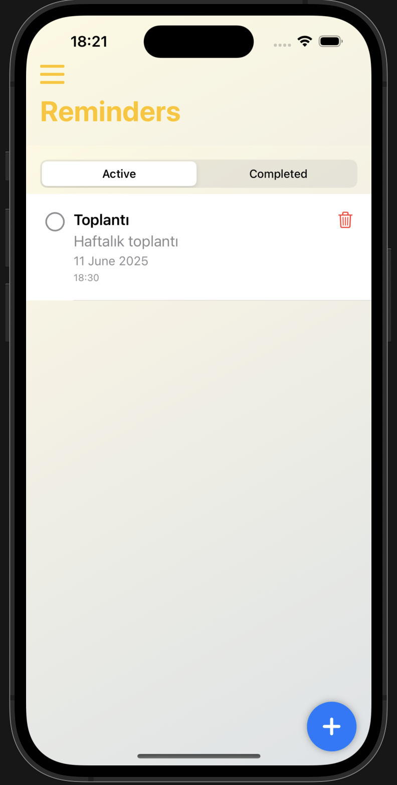
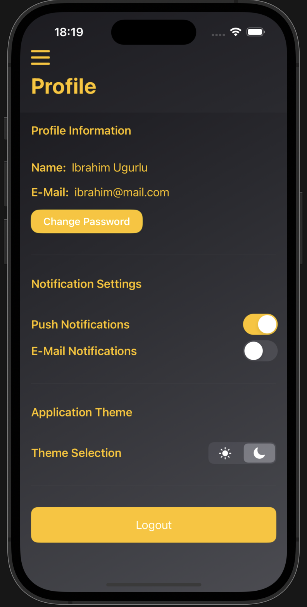

# Nexus

Nexus, iOS için geliştirilmiş kapsamlı bir kişisel organizasyon ve üretkenlik uygulamasıdır. Kullanıcıların günlük hayatlarını daha düzenli ve verimli hale getirmek için tasarlanmıştır.

## Ekran Görüntüleri

### Giriş ve Ana Ekran



### Temel Özellikler





## Özellikler

- 💬 Mesajlaşma: Gerçek zamanlı mesajlaşma ve dosya paylaşımı
- 📝 Notlar: Düşüncelerinizi ve fikirlerinizi kaydedin
- 📅 Hatırlatıcılar: Önemli görevleri ve etkinlikleri takip edin
- 📁 Dosyalar: Belgelerinizi düzenli bir şekilde saklayın
- 👤 Profil Yönetimi: Kişisel ayarlarınızı özelleştirin
- 🌓 Karanlık/Aydınlık Tema: Göz yorgunluğunu azaltan tema seçenekleri
- 🔒 Güvenli Giriş: Firebase Authentication ile güvenli hesap yönetimi

## Gereksinimler

- iOS 17.0 veya üzeri
- Xcode 15.0 veya üzeri
- Swift 5.0
- Firebase hesabı

## Kurulum

1. Projeyi klonlayın:
   ```bash
   git clone https://github.com/kullaniciadi/Nexus.git
   ```

2. Proje dizinine gidin:
   ```bash
   cd Nexus
   ```

3. Firebase yapılandırmasını ekleyin:
   - Firebase Console'dan yeni bir proje oluşturun
   - `GoogleService-Info.plist` dosyasını projeye ekleyin

4. Projeyi Xcode'da açın ve gerekli bağımlılıkları yükleyin:
   ```bash
   pod install
   ```

5. Uygulamayı çalıştırın:
   - Xcode'da projeyi açın
   - Bir simülatör seçin
   - Run (▶️) butonuna basın

## Kullanım

- Uygulamayı başlatın ve giriş yapın
- Ana ekrandan istediğiniz özelliği seçin:
  - Mesajlaşma: Diğer kullanıcılarla iletişim kurun
  - Notlar: Düşüncelerinizi kaydedin
  - Hatırlatıcılar: Görevlerinizi planlayın
  - Dosyalar: Belgelerinizi yönetin
  - Profil: Ayarlarınızı özelleştirin

## Katkıda Bulunma

1. Bu depoyu fork edin
2. Yeni bir özellik dalı oluşturun (`git checkout -b yeni-ozellik`)
3. Değişikliklerinizi commit edin (`git commit -am 'Yeni özellik eklendi'`)
4. Dalınıza push yapın (`git push origin yeni-ozellik`)
5. Bir Pull Request oluşturun

## Lisans

Bu proje MIT lisansı altında lisanslanmıştır.

## İletişim

- Proje Linki: [https://github.com/miugurlu/Nexus](https://github.com/miugurlu/Nexus)